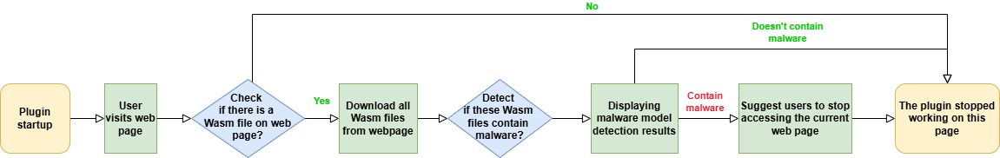
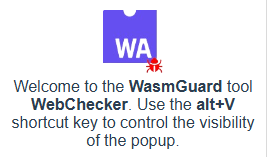
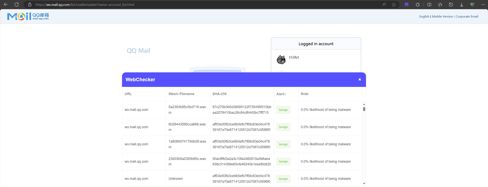
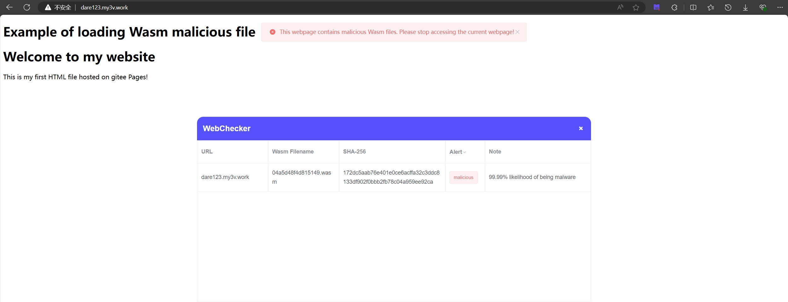

# WasmGuard: Enhancing Web Security through Robust Raw-Binary Detection of WebAssembly Malware

## Description
In this paper, we propose WasmGuard,  a robust malware detection framework tailored for Wasm. WasmGuard employs FGSM-based adversarial training with prior-based initialization for perturbation bytes in customized sections, coupled with a novel adversarial contrastive learning objective. If you find this paper or this repo is useful for you, we would like to have you cite our paper as follows.

> Yuxia Sun, Huihong Chen, Zhixiao Fu, Wenjian Lv, Zitao Liu, and Haolin Liu.2025. WasmGuard: Enhancing Web Security through Robust Raw-Binary Detection of WebAssembly Malware. In Proceedings of the ACM Web Conference 2025 (WWW ’25), April 28–May 2, 2025, Sydney, NSW, Australia. ACM, New York, NY, USA, 9 pages.

## WebChecker——A WasmGuard-based Detector Plugin

<div align="center">
  <br>
  Stay Safe, Browse Smart – With WebChecker.
</div>

### 🤗Introduction

#### 🤔What is WebChecker?

WebChecker is a **Chrome browser plugin** based on **WasmGuard**, designed to alert users about malicious WebAssembly (Wasm) files. Since some detection methods struggle in adversarial environments, our work, ***WasmGuard: Robust Raw-Binary Detection of WebAssembly Malware *** offers a robust solution, achieving high accuracy even under attack.

WebChecker works according to the following process:



#### 😮Demo

When launching WebChecker, users are greeted with a popup that introduces the tool and its quick-access features.

<div align="center">
  <br>
</div>

When a webpage is analyzed, users can call up WebChecker's panel, which lists detected Wasm files, their domain, filename, and detailed results indicating whether the file is benign or malicious.

<div align="center">
  <br>
</div>

When a malicious Wasm file is detected on a page, the plugin will call a popup window to **warn the user** that the current page is unsafe and to stop accessing the current page.

<div align="center">
  <br>
</div>

### 🥳Get Started

#### 😎Download and Installation

On our Github [Release page](https://github.com/Q8201/WasmGuard/releases), you can find the built WebChecker binary file with the suffix **.crx**.

To install **.crx** files into the browser, you can use the following methods:

- **Installation method 1**: Double-click the CRX file directly, confirm the addition according to the prompt, and you can restore the plugin to the browser.

- **Installation method 2**: Drag the CRX file to the browser plugin bar to quickly complete the installation.

- **Installation method 3**: Change the extension file suffix **.crx** to **.rar** or **.zip**, so that it becomes a compressed file. Unzip the file to get a folder, then enter the browser extension management page, select **"Load unzipped extension"**, select the folder just unzipped to load, and the installation is complete.

#### 💪Manual Installation

Run the following command to install dependencies:

```sh
npm i
```

To build the project, use:

```sh
npm run build
```

**Note:** If you've made changes to the `panel` or `popup` components, you'll need to navigate to their respective directories and rebuild them individually.

For the `panel`:

```sh
cd ./panel
npm run build
```

For the `popup`:

```sh
cd ./popup
npm run build
```

Finally, you can see some new files and folders generated in the source code directory. Use the **Installation method 3** mentioned in the [Download and Installation](#download-and-installation) section to load the **dist** folder to start using the plugin.

## 😉Citation
If you use this plugin in your research, please cite our paper on WWW’25:

Yuxia Sun, Huihong Chen, Zhixiao Fu, Wenjian Lv, Zitao Liu, and Haolin Liu.
2025. WasmGuard: Enhancing Web Security through Robust Raw-Binary
Detection of WebAssembly Malware. In Proceedings of the ACM Web Confer-
ence 2025 (WWW ’25), April 28–May 2, 2025, Sydney, NSW, Australia. ACM,
New York, NY, USA, 9 pages

####[Abstract] WebAssembly (Wasm), a binary instruction format designed for efficient cross-platform execution, has rapidly become a foundational web standard, widely adopted in browsers, client-side, and server-side applications. However, its growing popularity has led to an increase in Wasm-targeted malware, including cryptojackers and obfuscated malicious scripts, which pose significant threats to web security. In spite of progress in deep learning based detection methods for Wasm malware, such as MINOS, these approaches face substantial performance degradation in adversarial environments. In our experiments, MINOS’s detection accuracy dropped to 49.90\% under adversarial attacks, revealing critical vulnerabilities. To address this, we introduce \textbf{WasmGuard}, a robust malware detection framework tailored for Wasm. WasmGuard employs FGSM-based adversarial training with prior-based initialization for perturbation bytes in customized sections, coupled with a novel adversarial contrastive learning objective. Using our large-scale dataset, \textbf{WasmMal-15K} (publicly available at https://github.com/Yuxia-Sun/WasmMal), WasmGuard outperforms six competing methods, achieving up to 99.20\% Robust Accuracy and 99.93\% Standard Accuracy under PGD-50 adversarial attacks, while maintaining low training overhead. Additionally, we have released \textbf{WebChecker}, a WasmGuard-powered browser plugin, providing real-time protection against malicious Wasm files, at https://github.com/Yuxia-Sun/WasmGuard.-Sun/WasmMal), WasmGuard outperforms six competing methods, achieving up to 99.20\% Robust Accuracy and 99.93\% Standard Accuracy under PGD-50 adversarial attacks, while maintaining low training overhead. Additionally, we have released \textbf{WebChecker}, a WasmGuard-powered browser plugin, providing real-time protection against malicious Wasm files, at https://github.com/Yuxia-Sun/WasmGuard.